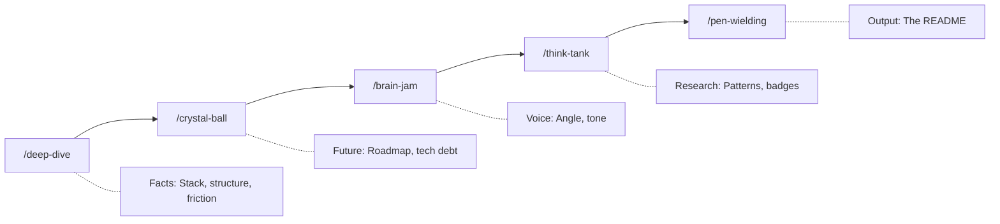

<p align="center">
  
</p>

<p align="center">
  <a href="LICENSE"></a>
  <a href="https://github.com/anthropics/claude-code"></a>
  
</p>

# Github Readme for Perfectionists

ESLint for prose. A Claude Code plugin that treats "delve" as a syntax error.

AI-generated documentation has a smell. You know it when you read it: *"This tool delves into the landscape of seamless integration..."* - zero information, pure filler. I bet reading that you thought, but this sounds like AI, you're right actually, written before using the plugin. 

**Before:**
> ~~This library provides a seamless way to delve into documentation generation, unleashing the full potential of your README workflow.~~

**After:**
> This plugin generates README files. It bans 11 filler words and enforces sentence patterns that require specifics.

## Quick Start

Requires [claudikins-marketplace](https://github.com/aMilkStack/claudikins-marketplace):

```bash
/plugin install claudikins-grfp
```

Then ask Claude to write a README. The plugin triggers and runs you through 5 phases.

## How It Works



Each phase produces artifacts. `/deep-dive` extracts codebase facts. `/crystal-ball` identifies what's missing. `/brain-jam` runs a Claude + Gemini debate to find the voice. `/think-tank` researches exemplar READMEs. `/pen-wielding` writes the final output with Anti-Slop rules enforced.

## The Banned Words

| Word | Replacement |
|------|-------------|
| Delve | Analyze, Check, Query |
| Seamless | Compatible, Integrated |
| Unleash | Run, Execute, Enable |
| Robust | Fault-tolerant, Atomic |
| Tapestry | System, Network, Stack |
| Landscape | Delete the sentence |
| Elevate | Improve (with a metric) |
| Testament | Proof, Example |
| Foster | Encourage, Allow |
| Spearhead | Lead, Direct |
| Game-changer | Solves [specific problem] |

If any of these appear in the output, the README fails its own rules.

## Quality Targets

| Metric | Target |
|--------|--------|
| Flesch-Kincaid | Grade 8-10 |
| Time to Joy | ≤3 commands |
| Visual Density | 1 per 300 words |
| Badge Count | 5-7 max |

## When NOT to Use This

- **You want full creative control.** GRFP enforces structure. It will fight you.
- **Your project is trivial.** A 20-line script doesn't need a 5-phase pipeline.
- **You need speed.** Each phase takes time. If you need a README in 30 seconds, use a template.
- **You hate opinionated tools.** The opinions are baked in.

## Requirements

- Claude Code 1.0+
- claudikins-tool-executor (recommended for Gemini integration)

Without tool-executor, brain-jam runs as a conversation with you instead of Claude + Gemini collaboration.

## License

[MIT](LICENSE)

---

*Delve Index: 0%*
