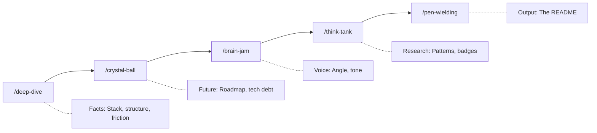

<p align="center">
  
</p>

<p align="center">
  <a href="LICENSE"></a>
  <a href="https://github.com/anthropics/claude-code"></a>
  
</p>

# Github Readme for Perfectionists

ESLint for prose. A Claude Code plugin that treats "delve" as a syntax error.

AI-generated documentation has a smell. You know it when you read it: _"This tool delves into the landscape of seamless integration..."_ - zero information, pure filler. I bet reading that you thought, but this sounds like AI, you're right actually, written before using the plugin.

**Before:**

> ~~This library provides a seamless way to delve into documentation generation, unleashing the full potential of your README workflow.~~

**After:**

> This plugin generates README files. It bans 15 filler words, enforces sentence patterns that require specifics, and includes humanisation patterns to make AI text sound human.

## Quick Start

Install via Claude Code Plugin:

```bash
# Add the Claudikins marketplace
/marketplace add aMilkStack/claudikins-marketplace

# Install the plugin
/plugin install claudikins-grfp
```

Then ask Claude to write a README. The plugin triggers and runs you through 5 phases.

## How It Works



Each phase produces artifacts. `/deep-dive` extracts codebase facts. `/crystal-ball` identifies what's missing. `/brain-jam` runs a Claude + Gemini debate to find the voice. `/think-tank` researches exemplar READMEs. `/pen-wielding` writes the final output with Anti-Slop rules enforced.

### What pen-wielding enforces

The final phase applies four governance files:

- **style-guide.md** - Banned words, sentence patterns, humanisation techniques, phrase templates
- **structural-templates.md** - Section ordering by project type, results tables, Do/Don't patterns
- **visual-engineering.md** - Mermaid diagrams, ASCII progress bars, visual density rules
- **anti-patterns.md** - Writing anti-patterns, research anti-patterns, quality checklist

<details>
<summary><strong>Sentence Patterns</strong></summary>

Three patterns you must vary between:

### The Hook (Pain → Solution)

**Use in:** Description, Intro

| Before                                         | After                                                      |
| ---------------------------------------------- | ---------------------------------------------------------- |
| "This library helps with JSON parsing issues." | "JSON logs are unreadable. Kinesis parses them instantly." |

### The Hammer (Fact + Metric)

**Use in:** Features, Performance

| Before                                          | After                           |
| ----------------------------------------------- | ------------------------------- |
| "The system is designed to be incredibly fast." | "Builds finish in under 200ms." |

### The Trust Builder (Constraint + Fallback)

**Use in:** Usage, Technical sections

| Before                              | After                                                     |
| ----------------------------------- | --------------------------------------------------------- |
| "Works perfectly on all platforms." | "Uses `epoll` on Linux; falls back to `kqueue` on macOS." |

</details>

<details>
<summary><strong>Humanisation Patterns</strong></summary>

Write TO readers, not AT them.

| Weak                                | Strong                                     | Why                              |
| ----------------------------------- | ------------------------------------------ | -------------------------------- |
| "Users can optionally configure..." | "Configure your preferences in..."         | Direct address over passive      |
| "The system enables..."             | "This helps you..."                        | Human over system                |
| "Consider implementing..."          | "Implement..."                             | Commands over suggestions        |
| "We achieved 2.4M reach"            | "We reached 2.4M people, 20% above target" | Context makes numbers meaningful |

</details>

<details>
<summary><strong>ASCII Visualisations</strong></summary>

For lightweight progress and status without images.

### Status Indicators

| Test        | Status |
| ----------- | ------ |
| Unit        | ✓      |
| Integration | ✓      |
| E2E         | ⚠      |

### Progress Bars

```
Coverage  [================    ] 80%
Types     [====================] 100%
Docs      [========            ] 40%
```

### Progress Funnel

```
Visitors   [XXXXXXXXXX] 1,000  (100%)
               |
Signups    [XXXXXXX   ]   700  (70%)
               |
Active     [XXXX      ]   400  (40%)
               |
Paid       [XX        ]   200  (20%)
```

</details>

<details>
<summary><strong>Do/Don't Patterns</strong></summary>

### Writing Anti-Patterns

| Don't                     | Why                   | Do Instead                        |
| ------------------------- | --------------------- | --------------------------------- |
| Passive voice             | Distances reader      | Direct address with "you"         |
| Hedging language          | Undermines confidence | State with appropriate confidence |
| Features without benefits | No motivation         | Feature + why it matters          |
| Overclaiming              | Destroys trust        | Be honest, flag limitations       |

### Research Anti-Patterns

| Don't                | Why                       | Do Instead                  |
| -------------------- | ------------------------- | --------------------------- |
| Assuming user needs  | Often wrong               | Validate with research      |
| Skipping testing     | Instructions may not work | Run the code yourself       |
| Generic descriptions | Don't resonate            | Specific, concrete examples |

</details>

## The Banned Words

| Word         | Replacement               |
| ------------ | ------------------------- |
| Delve        | Analyse, Check, Query     |
| Seamless     | Compatible, Integrated    |
| Unleash      | Run, Execute, Enable      |
| Robust       | Fault-tolerant, Atomic    |
| Tapestry     | System, Network, Stack    |
| Landscape    | Delete the sentence       |
| Elevate      | Improve (with a metric)   |
| Testament    | Proof, Example            |
| Foster       | Encourage, Allow          |
| Spearhead    | Lead, Direct              |
| Game-changer | Solves [specific problem] |
| Navigating   | Using, Working with       |
| Leverage     | Use, Apply, Employ        |
| Cutting-edge | Modern, Current           |
| Empower      | Allow, Enable, Let        |

If any of these appear in the output, the README fails its own rules.

## Quality Targets

| Metric         | Target          |
| -------------- | --------------- |
| Flesch-Kincaid | Grade 8-10      |
| Time to Joy    | ≤3 commands     |
| Visual Density | 1 per 300 words |
| Badge Count    | 5-7 max         |

## When NOT to Use This

- **You want full creative control.** GRFP enforces structure. It will fight you.
- **Your project is trivial.** A 20-line script doesn't need a 5-phase pipeline.
- **You need speed.** Each phase takes time. If you need a README in 30 seconds, use a template.
- **You hate opinionated tools.** The opinions are baked in.

## Requirements

- Claude Code 1.0+
- claudikins-tool-executor (recommended for Gemini integration)

Without tool-executor, brain-jam runs as a conversation with you instead of Claude + Gemini collaboration.

## License

[MIT](LICENSE)

---

_Delve Index: 0%_
