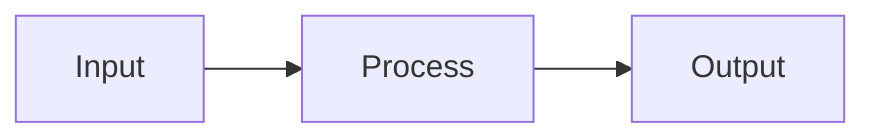
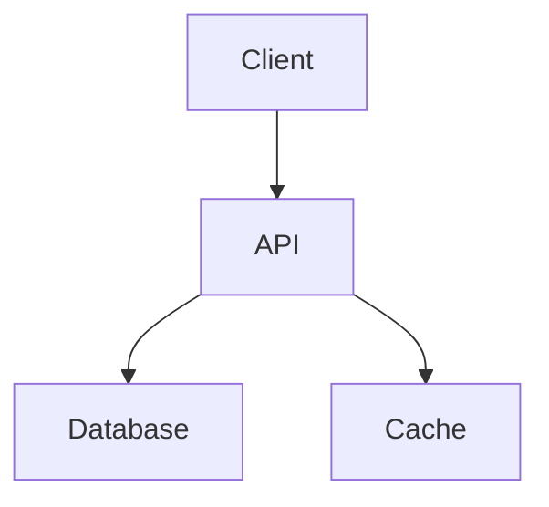
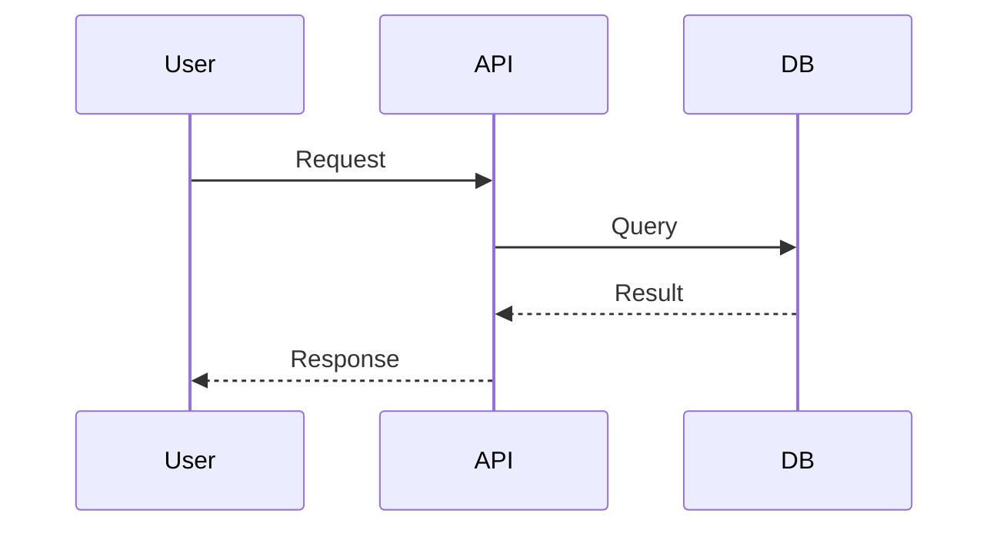
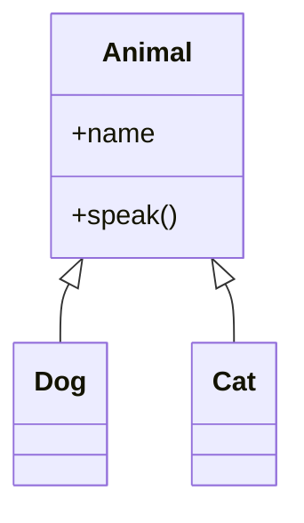

# Visual Engineering

Guidelines for GIFs, diagrams, and screenshots in READMEs.

## When to Use GIFs

Best for:

- **CLI tools:** Show terminal session
- **UI components:** Show interaction
- **Complex workflows:** Show step-by-step

**Tool recommendation:** VHS for reproducible terminal GIFs

```bash
# Install VHS
brew install vhs  # macOS
# or
go install github.com/charmbracelet/vhs@latest
```

**Example VHS tape:**

```
Output demo.gif

Set FontSize 14
Set Width 800
Set Height 400

Type "npm install my-tool"
Enter
Sleep 2s
Type "my-tool --help"
Enter
Sleep 3s
```

## When to Use Diagrams

Best for:

- **Architecture:** System components and connections
- **Data flow:** How data moves through system
- **Class relationships:** OOP hierarchies

**Use Mermaid** for GitHub-native rendering:

````markdown

````

**Common diagram types:**

### Flowchart (Architecture)



### Sequence (Data Flow)



### Class (Relationships)



## When to Use Screenshots

Best for:

- **UI applications:** Show the interface
- **Dashboards:** Show data visualisation
- **Config files:** Show expected structure

**Requirements:**

- Always include alt text for accessibility
- Compress images (target < 500KB)
- Use consistent dimensions
- Dark/light mode versions if applicable

**Markdown format:**

```markdown

```

## Visual Density Rule

**Target:** 1 visual per 300 words

If a section exceeds 300 words without a visual:

1. Add a code block
2. Add a diagram
3. Add a screenshot
4. Break into subsections with examples

## Accessibility

Every visual must have:

- **Alt text:** Descriptive, not decorative
- **Caption:** Context if not obvious
- **Text alternative:** Key info available without image

Bad: ``
Good: ``

## ASCII Visualisations

For lightweight progress and status indicators without images.

### Status Indicators

Use consistent symbols:

- ✓ or `[✓]` - Pass/Complete
- ✗ or `[✗]` - Fail/Incomplete
- ⚠ or `[!]` - Warning/Minor Issue

**Example in tables:**

| Test        | Status |
| ----------- | ------ |
| Unit        | ✓      |
| Integration | ✓      |
| E2E         | ⚠      |

### Progress Bars

```
Metric  [================    ] 80%
Metric  [========            ] 40%
Metric  [====================] 100%
```

**Use when:**

- Showing completion percentage
- Comparing multiple metrics visually
- README badges are overkill

### Progress Funnel

For showing conversion or stage progression:

```
Stage 1  [XXXXXXXXXX] 1,000  (100%)
              |
Stage 2  [XXXXXXX   ]   700  (70%)
              |
Stage 3  [XXXX      ]   400  (40%)
              |
Stage 4  [XX        ]   200  (20%)
```

**Use when:**

- Showing user journey
- Documenting conversion rates
- Explaining pipeline stages

### Priority Indicators

For tiered systems:

```
🔴 Critical - Must fix before release
🟡 Important - Should fix soon
🟢 Minor - Nice to have
```

Or without colour:

```
[!!!] Critical
[!!]  Important
[!]   Minor
```
